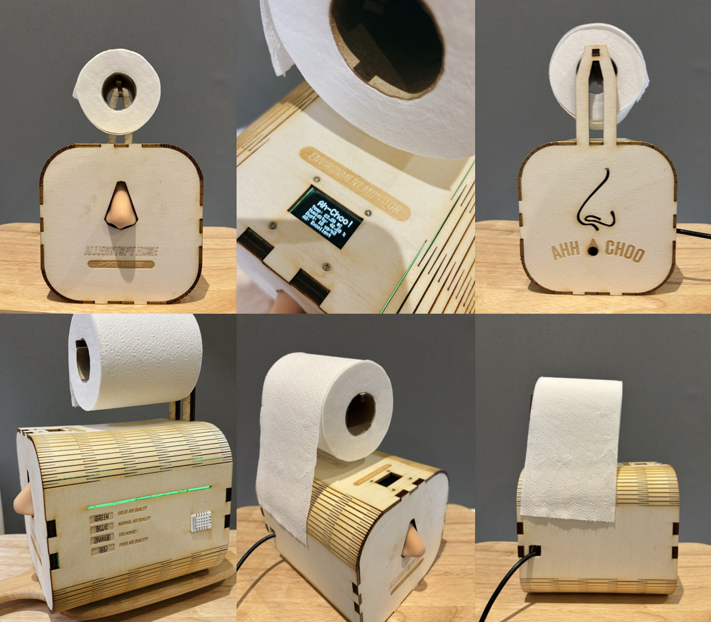
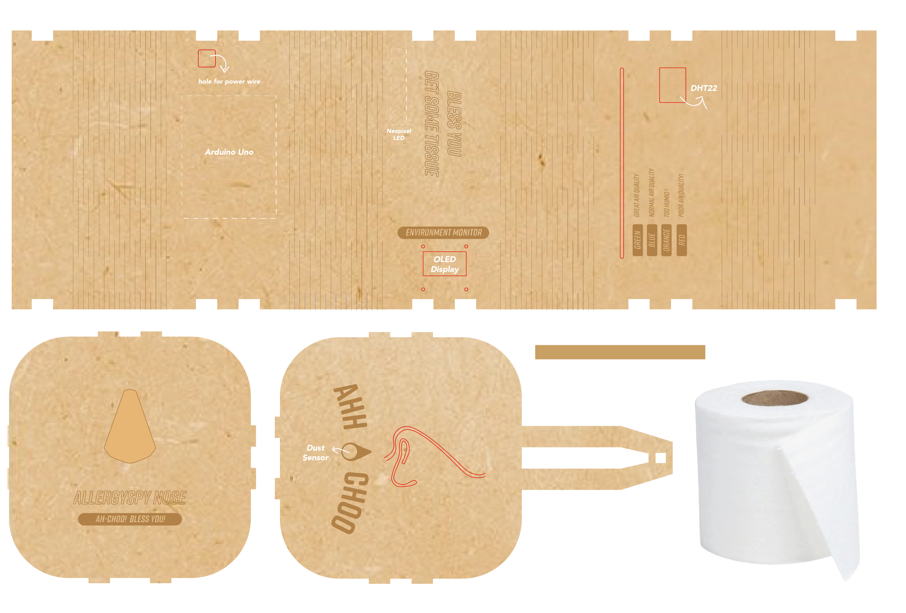
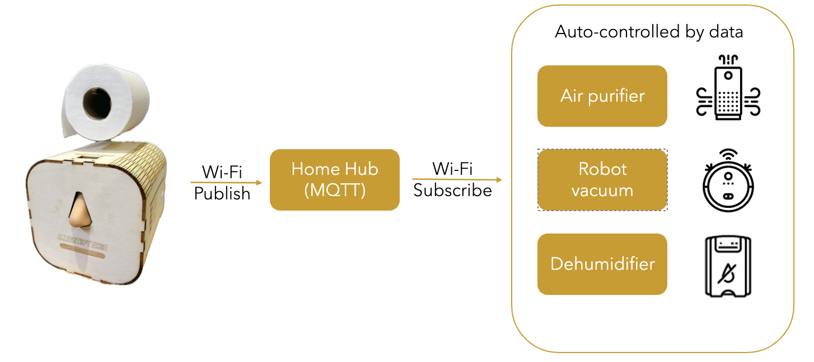

# 🤧 Allergy Spy Nose  
NASAL ALLERGEN DETECTOR​   
>Ah-Choo!

   

The 'Allergy-Spy Nose' is an innovative device designed to enhance indoor air quality by detecting airborne allergens. Rooted in addressing severe nasal allergies, this system synergizes a particulate matter sensor (GP2Y1010AU0F) and a DHT22 sensor with an Arduino Uno microcontroller. It offers real-time air quality monitoring, visually represented via an OLED display and a colour-coded NeoPixel LED array. This device is tailored to improve living conditions for allergy sufferers, epitomising the integration of environmental sensing technology in health-centric applications. This report explores the device’s design, functionality, and potential impact on allergen detection, underscoring its significance in environmental health management.  
## Background  
Inspired by the concept of an electronic nose applied to environmental monitoring, this project originates from my own experiences with severe nasal allergies. ​ 
Living in a city with high pollen and dust levels has made managing my allergies a daily challenge, driving my need to constantly monitor the air quality and humidity in my home to reduce allergy triggers.​  
## Crafting a Nose-Friendly Haven!  
A device that can detect common airborne allergens, humidity, and alert user to take preventive actions, such as cleaning or ventilating the area. This will help in maintaining an allergen-free environment at home.​  
## Materials  
- Microcontroller Board: Arduino Uno​  
- Sensors: Dust Sensor GP2Y1010AU0F, DHT22 ​  
- Actuators: NeoPixel LED​  
- Passive Components: Resistors, Capacitor ​  
- Display: OLED Display
  

## Enclosure Design  
The Allergy-Spy Nose is an innovative design that fuses a dust sensor with a tissue holder. Inspired by Japanese inventor Kenji Kawakami's Hay Fever Hat [4], a hat designed to hold a tissue box for allergy sufferers to access quickly, the Allergy-Spy Nose aims to provide practicality and convenience. The design focuses on blending seamlessly into indoor environments, combining wood's aesthetic appeal with a tissue holder's functionality. This approach ensures the product is helpful for daily needs and visually appealing.  

## Future Development 

The current prototype stands for a foundational step towards creating a more intelligent home environment. Future versions will integrate with home automation systems, offering features like panel customization and Wi-Fi connectivity. Such advancements will automatically enable the device to interact with other smart home appliances, like air purifiers, Robot vacuums and dehumidifiers. This integration aims to significantly improve living conditions for those suffering from allergies, making their homes more adaptable and responsive to their health needs. 

 

## Reference  

1. Persaud, K., Dodd, G. (1982). Analysis of discrimination mechanisms in the mammalian olfactory system using a model nose. Nature 299, 352–355. doi: 10.1038/299352a0. 

2. NHS SCOTLAND (2023). Allergic rhinitis. [online] Available at: https://www.nhsinform.scot/illnesses-and-conditions/ears-nose-and-throat/allergic-rhinitis#causes-of-allergic-rhinitis. 

3. SHARP (n.d.). Application note of Sharp dust sensor GP2Y1010AU0F (Sheet No.: OP13024EN). [online] Available at: https://global.sharp/products/device/lineup/data/pdf/datasheet/gp2y1010au_appl_e.pdf 

4. Megan Bilaloski (2012). The Hay Fever Hat wins...by a nose. The Sydney Morning Herald. [online] Available at: https://www.smh.com.au/lifestyle/the-hay-fever-hat-winsby-a-nose-20120312-1uwcl.html 

5. Waveshare (2015). Dust Sensor User Manual-EN V1.4. [online] Available at: https://www.waveshare.com/wiki/File:Dust-Sensor-User-Manual-EN.pdf 
